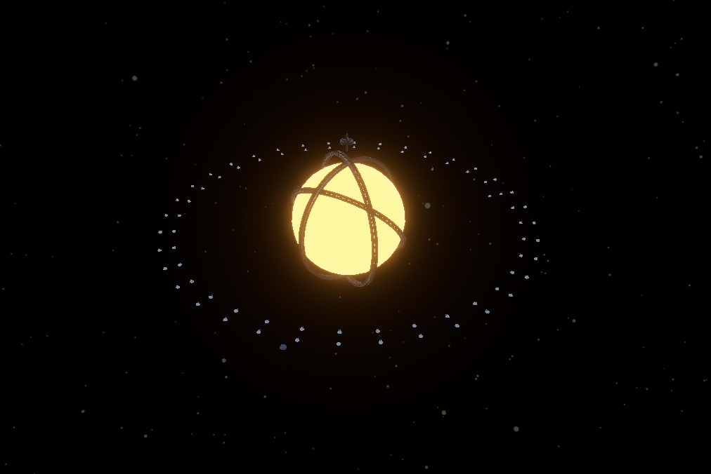

# RTS-Game
A narrative-driven space RTS (WIP) focused on atmosphere, exploration, and base defense. The project combines strategic gameplay with a strong focus on creating a tense and mysterious sci-fi experience.
##[Project video](https://www.youtube.com/watch?v=FG9L2SGI-yo)(YouTube)
## Screenshots

## implemented systems

- Base building
- AI (prototype)
- Ecomomy
- Saving
- Global Map Mode
- UI

## Technologies used

- Unity
- C#
- Git

## Project architecture
The project uses a modular approach where gameplay systems are separated into independent components. Key architectural elements: - Base classes are used for shared gameplay logic (for example, different buildings inherit from a common Building class). - Manager classes control global systems such as resources, skills, mining, and game state. - C# Events are used for communication between systems, such as updating UI when gameplay values change. - UI logic is separated from gameplay objects through dedicated managers.

## Development plans
- "Dialogue" system
-  Decision-making system
-  Dynamic AI for enemies and defences

